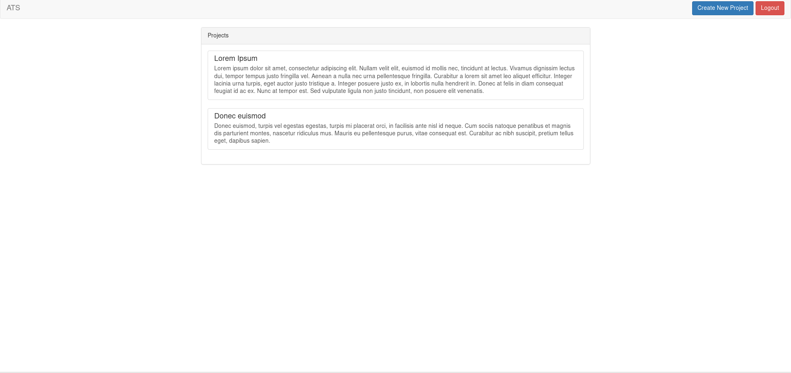
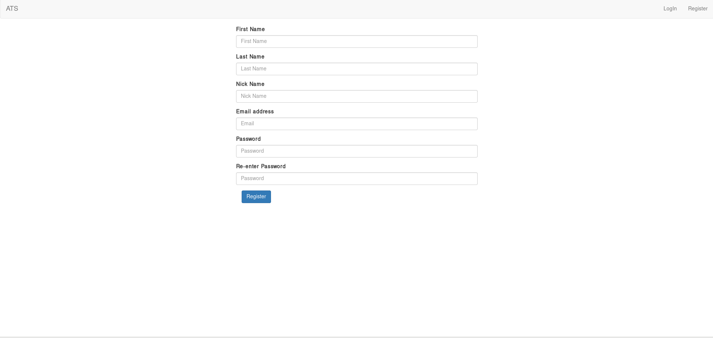
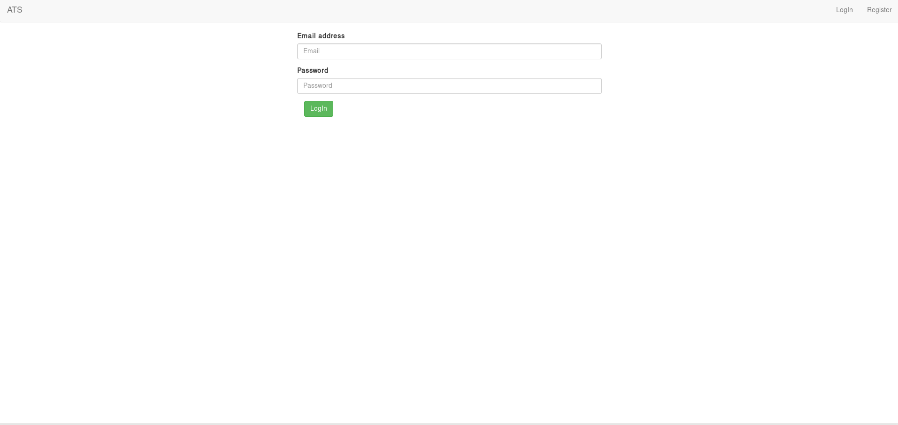
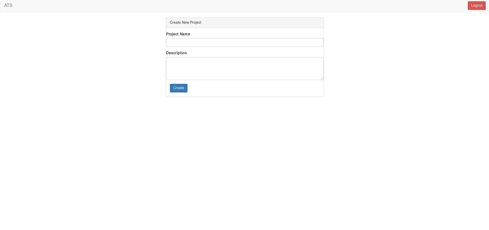
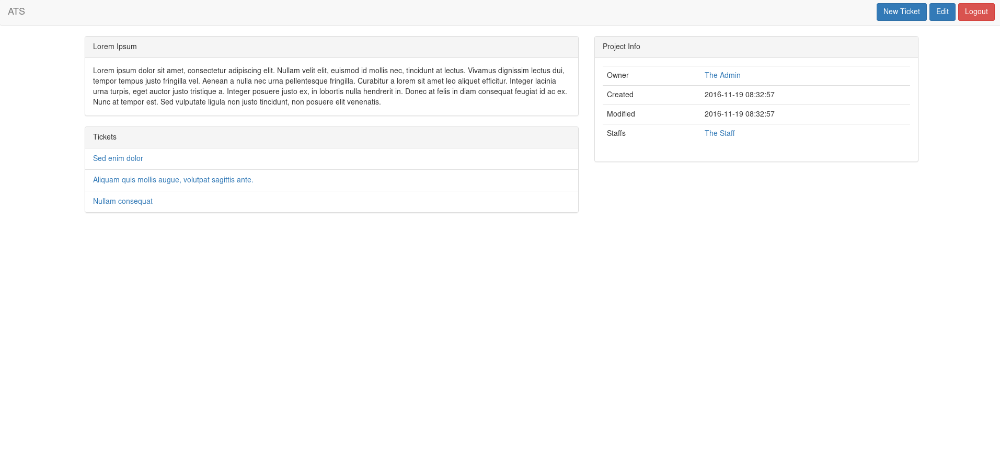
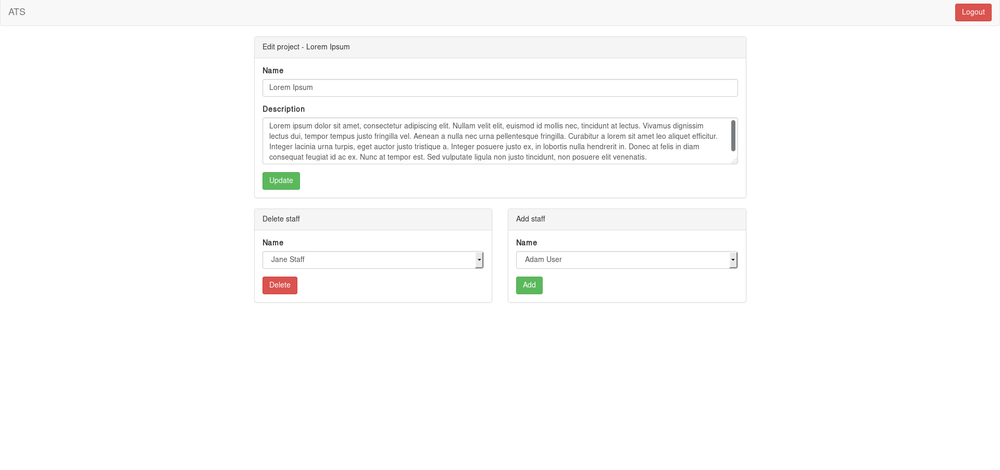
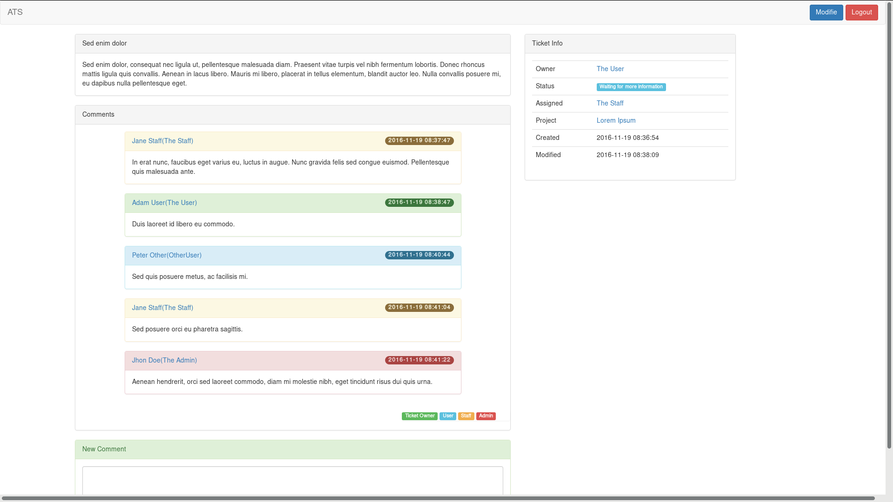
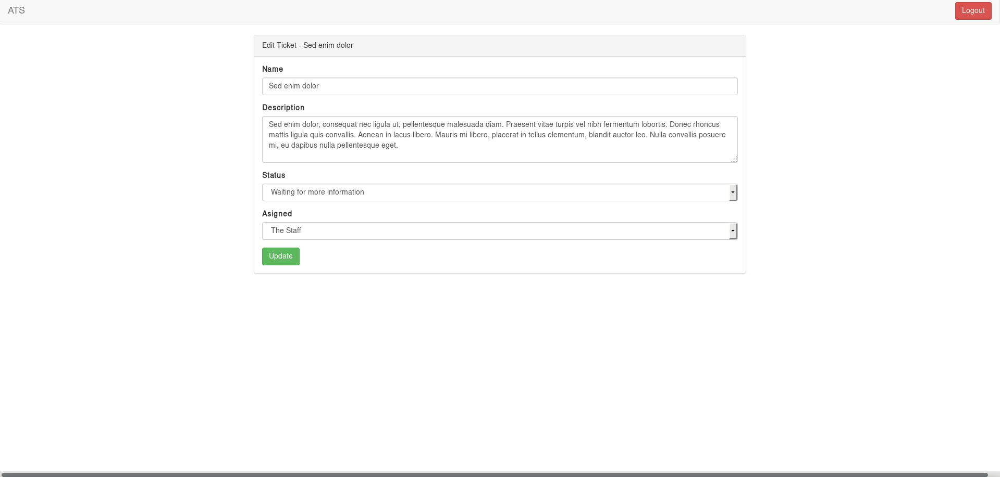
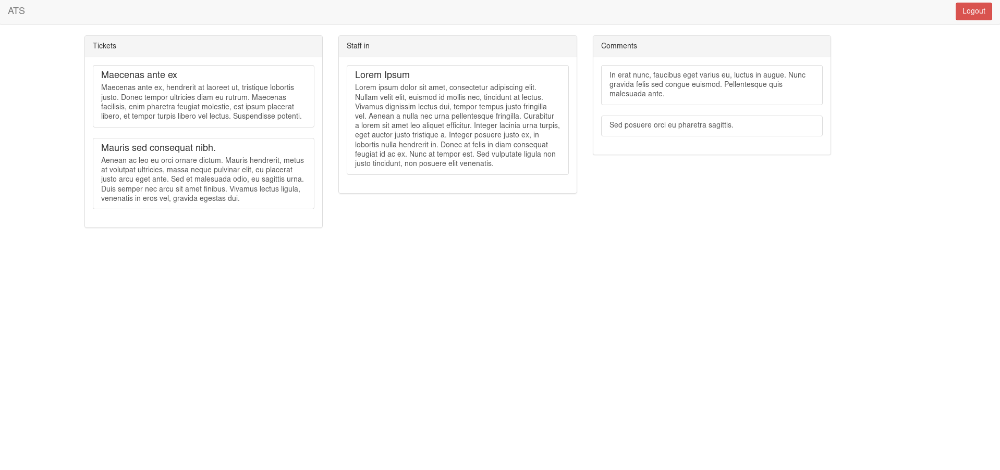

# ATS !()[http://ww1.prweb.com/prfiles/2012/11/16/10144208/gI_86305_association-technology-solutions-logo-denver-colorado.png]
Another Ticket System

## 1 Követelmény analízis

### 1.1 Célkitűzés

A program célja egy könnyen és egyszeráen használható hiba jegyrendszer létrehozása. Az adatok védelme érdekében csak regisztrált és megfelelő jogusultságokkal rendelkező felhasználók férhetnek hozzá bizonyos funkciókhoz. Ezen felül a különböző jogkörök is segítik az adatok védelmét.

#### Funkcionális követelmények

- Regisztráció
- Bejelentkezés
- Mindenki számára elérhető:
    - Projektek megtekintése
    - projektekhez tartozó bejegyzések megtekintése
- Felhasználók számára elérhető:
    - Új hiba jegy felvétele
    - Kommentelés a hibákhoz
- Staffnak elérhető:
    - Hiba jegyek állapotának módosítása
    - Staff hozzárendelés
- Adminak elérhető:
    - Új projekt indítása
    - Staff kijelőlése a saját projektjéhez

#### Nem funkcionális követelmények:

- **Áttekinthetőség:** Jegyek csoportosítása, állapot szerint

- **Megbízhatóság:** jelszóval védett funkciók, és jelszavak védelme a háttérben. Hibásan bevitt adatok esetén a program jól láthatóan jelezzen a felhasználónak, és emelje ki a hibás beviteli mezőket. A jól bevitt adatok maradjanak az űrlapban.

- **Karbantarthatóság:** könnyen lehessen bővíteni, a különböző típusú fájlok külön csoportosítva, ésszerűen legyenek felbontva, a könnyebb fejleszthetőség miatt

#### 1.2 Fogalomjegyzék
- **jegy:** egy az aktuális projekthez tartozó probléma, hiba átfogó megnevezése

####  1.3 Használatieset-modell, funkcionális követelmények

**Vendég**: Csak a publikus oldalakat éri el
- Főoldal
- Bejelentkezés
- Regisztráció
- Projektek / jegyek megtekintése

**Bejelentkezett felhasználó**: A publikus oldalak elérésén felül egyéb funkciókhoz is hozzáfér.
- Új hiba jegy felvétele
- Kommentelés a hibákhoz

**Staffnak elérhető:** A felhasználói szinten túl
- Hiba jegyek állapotának módosítása
- Staff hozzárendelés

**Adminak elérhető:** A staff szinten túl
- Új projekt indítása
- Staff kijelőlése a projektjeihez

###2.	Tervezés

#####2.1.	Architektúra terv

######2.1.1. Oldaltérkép:

**Publikus:**
* Főoldal
* Bejelentkezés
* Regisztráció
* Projektek
* Ticketek

**Bejelentkezett:**
(A publikusokon túl)
* Ticket oldal
    * Új ticket felvétele

**Staff**
(A bejelentkeztten túl)
* Ticket módostása

**Admin**
(A Staffon túl)
* Főoldal
    * Új projekt indtása
* Projekt oldal
    * Projekt módostása
    * Staff hozzárendelés

######2.1.2. Végpontok

* GET/ : főoldal
* GET/register : regisztrációs oldal
* POST/register : regisztrált adatok elküldése
* GET/login : bejelentkező oldal
* POST/login : bejelentkezési adatok elküldése
* POST/logout : kijelentkezés
* GET/create/project : projekt létrehozás oldal
* POST/create/project : projekt adatainak elküldése
* GET/project/:id : projekt oldal
* GET/create/ticket/:id : új ticket létrehozása oldla
* POST/create/ticket/:id : ticket adatainak eltküldése
* GET/ticket/:id : ticket olda
* POST/comment/add : komment elküldése
* GET/update/ticket/:id : ticket módosítás oldal
* POST/update/ticket/:id : módosított ticket adatok elküldése
* GET/update/project/:id : projetk módosító oldal
* POST/update/project/:id : projekt módosítás elküldése
* POST/update/project/:id/delete/staff : staff törlés
* POST/update/project/:id/add/staff : staff hozzáadás

#####2.2. Felhasználói-felület modell

######2.2.1. Designtervek (végső megvalósítás kinézete):

**Főoldal**

**Register**

**LogIn**

**Project létrehozás**

**Project oldal**

**Project Módosítás**

**Ticket**

**Ticket Módosítás**

**User**

######2.2.3. Osztálymodell

 **Adatbázisterv**
 

###3.	Implementáció

######3.1.1. Fejlesztőkörnyezet

Text Editor: **Atom**

**Github**
* Github account szükséges
* Ezután elkezdhetjük a kód írását
* _git add <fajlnev>_ paranccsal kiválaszthatunk egy fájlt verzionálásra, vagy _git add ._ paranccsal az összes fájlt kiválaszthatjuk
* _git commit -m "commit"_ paranccsal feltehetjük a fájlokat a cloud9 helyi tárolójába. Az így megjelölt verziókhoz a későbbiekben visszatérhetünk, különbségüket megtekinthetjük.
* _git push origin master_ paranccsal a lokális tárolóból feltölthetjük a tartalmat a Github-ra.
* Végezetül a Github oldalán leellenőrizhetjük a munkánkat.

######3.1.2. Könyvtárstruktúra, funkciók

* **ats**
    * **core**
        * **app**
        * **Commands**
            * _Greet.js_
        * **Http**
            * **Controllers**
                * _CommentController.js_
                * _LoginController.js_
                * _MainController.js_
                * _ProfileController.js_
                * _ProjectController.js_
                * _TicketController.js_
            * **Middleware**
                * _Authentication.js_
                * _Authorization.js_
            * _kernel.js_
            * _routes.js_
        * **Listeners**
            * _Http.js_
        * **Model**
            * _Comment.js_
            * _Connection.js_
            * _Project.js_
            * _Ticket.js_
            * _Token.js_
            * _User.js_
        * **bootstrap**
            * _app.js_
            * _events.js_
            * _extend.js_
            * _http.js_
            * _kernel.js_
        * **config**
        * **database**
            * **migrations**
                * _1477838213483_create_user_table.js_
                * _1477838213485_create_tokens_table.js_
                * _1478037208362_projects.js_
                * _1478092223610_tickets.js_
                * _1478107699633_comments.js_
                * _1478169510747_connections.js_
            * **seeds**
                * _Database.js_
            * _development.sqlite_
            * _factory.js_
        * **public**
          * _my-style.css_
        * **resources**
          * **errors**
          * _createProject.njk_
          * _createTicket.njk_
          * _index.njk_
          * _login.njk_
          * _main.njk_
          * _master.njk_
          * _navbar.njk_
          * _profile.njk_
          * _project.njk_
          * _projectUpdate.njk_
          * _register.njk_
          * _ticket.njk_
          * _ticketUpdate.njk_
          * _welcome.njk_
        * **storage**
        * _.editorconfig_
        * _.env_
        * _.env.example_
        * _ace_
        * _config.json_
        * _custom.json_
        * _package.json_
        * _server.js_
        * _settings.json_
        * _users.json_
    * **doc**
        * **img**
            * _usecase.png_
            * _usecase_
    * _note.md_
    * _README.md_

###4.	Felhasználói dokumentáció

**Futtatáshoz szükséges operációs rendszer:** Tetszőleges operációs rendszer

**A futtatáshoz szükséges hardver:** Operációs rendszerek szerint megadva

**Egyéb követelmények:** Internet böngésző telepítése, JavaScript ajánlott

**Program használata:**

1. Böngészőben nyissuk meg a főoldalt
2. Jobb felső sarokban kattintsunk a LogIn feliratra
3. Bejelentkezés/Regisztráció után a Főoldal oldalra jutunk
4. Adminként felvehetünk új projektet
5. Töltsük ki az űrlapot
6. Hibás adatok esetén az űrlap jelezni fogja a hibát
7. Submit gombra kattintva mentsük el az adatokat
8. Projekt oldalon: felvehetünk új ticketet
9. Projekt oldalon: modósíthatjuk a projektet és új staff tagokat veheetünk fel
9. Projekt oldalon: a ticketre kattintva a ticket oldalra jutunk
10. Ticket oldalon: új kommentet írhatunk
11. Ticket oldalon: módosíthatjuk a ticketet

###6.	Irodalomjegyzék:

http://webprogramozas.inf.elte.hu/alkfejl.php

http://ade.web.elte.hu/wabp/lecke2_lap1.html

http://webprogramozas.inf.elte.hu/alkfejl/A_dokumentacio_felepitese.pdf
